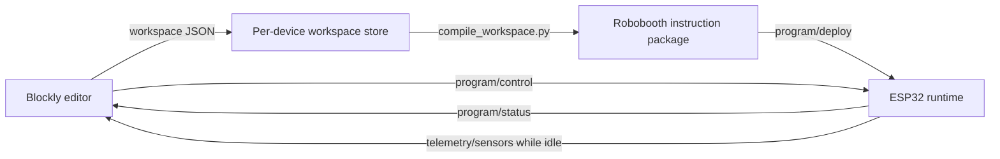

# Robot/web contracts

This directory is the source of truth for data that crosses the boundary between the Blockly web editor, the
workspace compiler, and the ESP32 robot runtime. A saved Blockly workspace is an editor artifact; it is never sent
directly to the robot. The Python compiler turns it into a versioned instruction package first.



## Contract artifacts

- [MQTT v1 protocol](robobooth-mqtt-v1.md) defines topics, ownership, delivery semantics, lifecycle, and limits.
- [Sensor snapshot schema](schemas/sensor-snapshot.schema.json) is implemented by the web MQTT receiver now.
- [Instruction package schema](schemas/program-package.schema.json) is emitted by
  [`tools/compile_workspace.py`](../../tools/compile_workspace.py).
- [Deployment schema](schemas/program-deploy.schema.json), [control schema](schemas/program-control.schema.json),
  and [program status schema](schemas/program-status.schema.json) define the future upload/run exchange.

All version numbers are integers. Additive, optional fields may be introduced within a version, but a required field,
meaning, unit, range, or topic change requires a new contract version. Consumers must reject an unsupported version
before acting on the payload.

## Units and naming

- JSON property names use `camelCase`.
- Distances cross the wire in millimetres; the UI may display centimetres.
- Angles cross the wire in degrees.
- Time intervals cross the wire in milliseconds unless the property says otherwise.
- Percent values use the inclusive range `0..100`, or `-100..100` when direction is meaningful.
- Device IDs use `robotbooth-<lowercase alphanumeric id>` and are part of every device topic.

The schemas are transport contracts, not firmware storage layouts. The ESP32 may use compact structs or bytecode
internally as long as validation and observable behaviour match this contract.

## Compile a saved workspace

The compiler uses only the Python standard library:

```powershell
python tools/compile_workspace.py `
  "$env:LOCALAPPDATA\RobotCompetitionBooth\device-programs\robotbooth-0123456789ab\Program 1.json" `
  --output "Program 1.robobooth.json"
```

It fails closed on malformed graphs, duplicate block IDs, excessive graph size/depth, and multiple on-start stacks.
Any loose top-level stack is retained with a warning but is marked `looseStack`, so the robot never schedules it
automatically.
